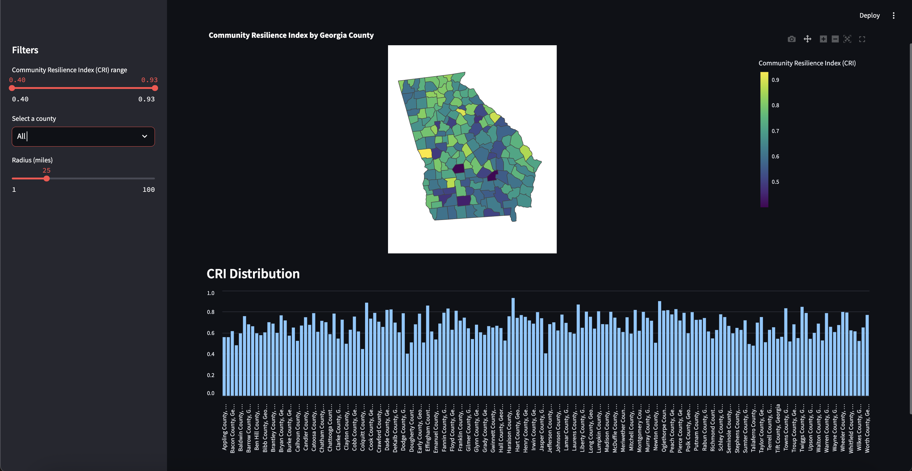

# Georgia-Community-Resilience-Index
## Purpose 
- Making a community resiliency index score where the goal is to take multiple socioeconomic factors from census pulls, data from different organizational entities, etc. to create a risk indicator for all counties in Georgia

## Until Checkpoint #3

### Clone the Repository and Set Up the Environment
- Go to the folder where you want your repository to be cloned
- Open terminal in that folder
- Run the cell below in terminal
``` bash
https://github.com/yourusername/community-resilience-index.git
cd community-resilience-index
```
- When it asks for your GitHub username and password, enter those credentials
- To create a virtual Python environment, run the cell below in terminal
``` bash
python3 -m venv venv
source venv/bin/activate        # macOS/Linux
# .\venv\Scripts\activate      # Windows PowerShell
pip install --upgrade pip
pip install pandas requests
```
### Pulling the Resilience_Socio Score For Each County
- To run ```census-pull.py```, you have to first get your own API key
- Head over to this website : https://api.census.gov/data/key_signup.html
- Enter your organization name and email, and you will receive an email with your API key
- In terminal, export the API key by running the following cell below
``` bash
export CENSUS_API_KEY="YOUR_CENSUS_KEY"         # macOS/Linux
$Env:CENSUS_API_KEY="YOUR_CENSUS_KEY"           # Windows PowerShell
```
- Now, run this cell below
``` bash
python census-pull.py
```
- All of the data that you wanted to pull should now be seen in your directory under the name ```socioeconomic_full.csv``` in the path ```src\data```
- Within this CSV file, you will now see three metrics --> Poverty Rate, Percent of Population with no HS Education, and the Percent of Population that >30% of their income for their housing
- Using those metrics, we normalized them via a min-max method and then averaged thosse scores to get a Socioeconomic Vulnerability Score (SEV)
- Using that SEV score, we can find the resiliency score which is just 1 - SEV.

### Pulling the Resilience_Food Score For Each County
  - Head on over to this website : https://www.ers.usda.gov/data-products/food-access-research-atlas/download-the-data/
  - From there, go to current version and download the zip
  - Save the zip in under the path ```src\data``` (where all the other files are)
  - Save ```usda_loader.py``` in ```src```
  - Run this cell below in terminal
    ```bash
    python usda_loader.py
    ```
  - This cell will take ```socioeconomic_full.csv```, and merge it with the file ```Food Access Research Atlas```
  - It will make a CSV file called ```food_access_score.csv``` saved under the data folder
  - The CSV file will show the Food Insecurity Score (FIS) simply the fraction of its census tracts that are classified as both low-income and low-access (LILA). LILA refers to the neighborhods of the county that have to travel further than normal thresholds for high quality, nutritional groceries despite the limited financial conditions.
  - The Food Resilience Score can be calculated by simply computing 1 - FIS. 

### Pulling the Resilience_Health Score For Each County
- Since, we are getting the healthcare data from the same ACS platform, we don't need to get another API key for it
- All we have to do is open up the same terminal again and run the cell below
``` bash
python uninsured.py
```
- Now, you should a see a CSV file of the uninsured population under 65 data under the name of ```healthcare_uninsured_counts.csv```
- Next, we can run the script that we have made ```healthcare_resilience.py```
- Run the cell below
```bash
python healhcare_resilience.py
```
- When we run this script, we load in ``healthcare_uninsured_counts.csv``
- We end up getting ```healthcare_resilience.csv```
- In that CSV file, we can see the normalized scores and the Resilience_Health score

### Computing the Community Resilience Index (CRI) score
- Now, that we all the resilience scores for our data, we can go ahead and compute the CRI score.
- We created a script called ```compute_CRI.py``` to calculate our CRI score
- This script loads in our relevant CSV files that contain our resilience scores from our socioeconomic aspect, our food availability aspect, and healthcare aspect
- Run the cell below in terminal
  ```bash
  python compute_CRI.py
  ```
- As a result, we get an output of ```community_resilience_index.csv``` in the data folder
- This folder contains all the counties, the state, resilience scores for each county, and the CRI score for the county

### Creating the Streamlit Interactive App (Interactive Map)
- Using our ```community_resilience_index.csv``` file, we went ahead and created an interactive map of the state of Georgia and all the counties within it
- Users can filter the range of CRI scores they want to look at, specific counties they want to look at, or even radius from a counties to other counties
- To create this map, we have all the code stored within our python file - ```interactive_dashboard.py```
- To run this file and create this interactive map on our local host, we have to do a few things first
- First, head over to this GitHub repo - [Repo for the GeoJSON file](https://gist.github.com/sdwfrost/d1c73f91dd9d175998ed166eb216994a#file-counties-geojson)
- Download the zipfile, and save the GeoJSON file as ```counties.geojson``` in our ```src\data``` directory
- Now, to run this script, we also need to make sure we have a few dependencies installed
- In terminal, run the following cells below
  ``` bash
  pip install pandas plotly
  ```
  ``` bash
  pip install streamlit
  ```
- Now, that you have all the necessary files in the right place, you can run the script by simply running the command below in terminal
  ``` bash
  streamlit run interactive_dashboard.py
  ```
- Running that will take you to a website on your host machine where the user can use filters and analyze the interactive map
- This interactive map screenshot can be seen below
- 
- Another specific instance showing the filters is attached below
- 
- In the image above, the user wants to see all counties that have a CRI score ranging from 0.40 to 0.83 that is in a 50 mile radius of Forsyth County, GA
- The hover aspect allows the user to hover over different counties and see their respective resilience scores as well as total CRI score
- By the next checkpoint, this interactive map will be open to the public to use meaning users don't have to clone the project and run all scripts to interact with the map

### Current Repo Structure
```
community-resilience-index/
│
├── src/
│   ├── census-pull.py
│   ├── sev.py
│   ├── usda_loader.py
│   ├── uninsured.py
│   ├── healthcare_resilience.py
│   └── data/
│       ├── healthcare_resilience.csv
│       ├── healthcare_uninsured_counts.csv
│       ├── food_access_score.csv
│       ├── healthcare_uninsured_counts.csv
│       ├── socioeconomic_full.csv
│       └── socioeconomic_sev.csv
│
└── README.md
